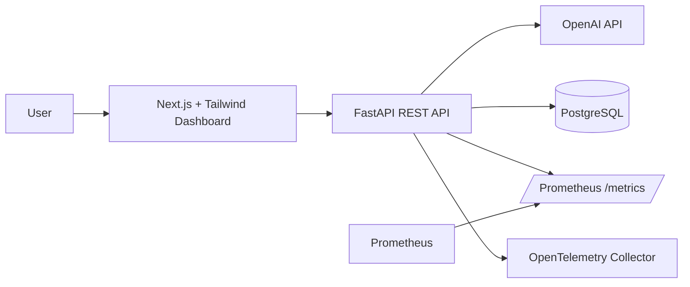

# LLM Observability Platform

Production-style MVP for monitoring LLM application reliability, cost, latency, token usage, errors, prompts, responses, prompt-security signals, traces, and Prometheus metrics.

## Architecture



## Features

- `POST /api/chat` sends prompts to OpenAI and captures latency, tokens, cost, model, timestamp, errors, and responses.
- PostgreSQL persistence through async SQLAlchemy.
- Prometheus metrics at `/metrics`.
- OpenTelemetry tracing for FastAPI, SQLAlchemy, HTTP clients, and LLM orchestration.
- Structured JSON logs with request IDs.
- Basic AI security checks for prompt injection, jailbreak, role manipulation, and credential exfiltration patterns.
- Next.js dashboard with recent requests, total cost, average latency, error count, suspicious prompts, and token usage.

## Repository Layout

```text
llm-observability-platform/
├── backend/                  # FastAPI service
├── frontend/                 # Next.js dashboard
├── docs/                     # Architecture notes
├── prometheus/               # Prometheus scrape config
├── .github/workflows/        # CI
├── docker-compose.yml
├── otel-collector-config.yml
└── .env.example
```

## Local Setup

1. Create an environment file:

```bash
cp .env.example .env
```

2. Set `OPENAI_API_KEY` in `.env`.

3. Start the stack:

```bash
docker compose up --build
```

4. Open the services:

- Frontend: http://localhost:3000
- Backend docs: http://localhost:8000/docs
- Prometheus metrics: http://localhost:8000/metrics
- Prometheus UI: http://localhost:9090

## Development

Backend:

```bash
cd backend
python -m venv .venv
source .venv/bin/activate
pip install -r requirements.txt
uvicorn app.main:app --reload
```

Frontend:

```bash
cd frontend
npm install
npm run dev
```

## API

Send a prompt:

```bash
curl -X POST http://localhost:8000/api/chat \
  -H "content-type: application/json" \
  -d '{"prompt":"Explain OpenTelemetry for LLM systems","model":"gpt-5-mini"}'
```

Get dashboard metrics:

```bash
curl http://localhost:8000/api/dashboard/metrics
```

Get recent requests:

```bash
curl http://localhost:8000/api/requests
```

## Observability Notes

Prometheus metrics include request counts, HTTP latency, LLM request status, token totals, estimated cost, and provider latency. Tracing is enabled through OpenTelemetry and exports to the local collector over OTLP HTTP. Logs are structured as JSON for ingestion by log backends.

## AI Security Notes

The MVP includes deterministic prompt screening for common prompt-injection and exfiltration signals. These checks are intentionally simple and auditable. A production version should add policy engines, allowlists, model-based classifiers, content redaction, and human-review workflows.

## Screenshots

Add screenshots after the app is running:

- `docs/screenshots/dashboard.png`
- `docs/screenshots/prometheus.png`
- `docs/screenshots/traces.png`

## Roadmap

- Alembic migrations.
- Authentication and tenant isolation.
- Trace drill-down pages.
- Per-project API keys and usage quotas.
- Export integrations for Grafana, Datadog, and OpenTelemetry backends.
- Prompt and response redaction.
- Model/provider comparison views.
- Streaming chat support.
- Error budget and SLO reporting.

## CI

GitHub Actions runs backend lint/tests and frontend typecheck/build on pull requests and pushes to `main`.

## Pricing Assumption

The cost estimator uses an explicit per-1M-token table for common OpenAI models and defaults to `gpt-5-mini`. Update `backend/app/services/cost.py` when model pricing changes.
