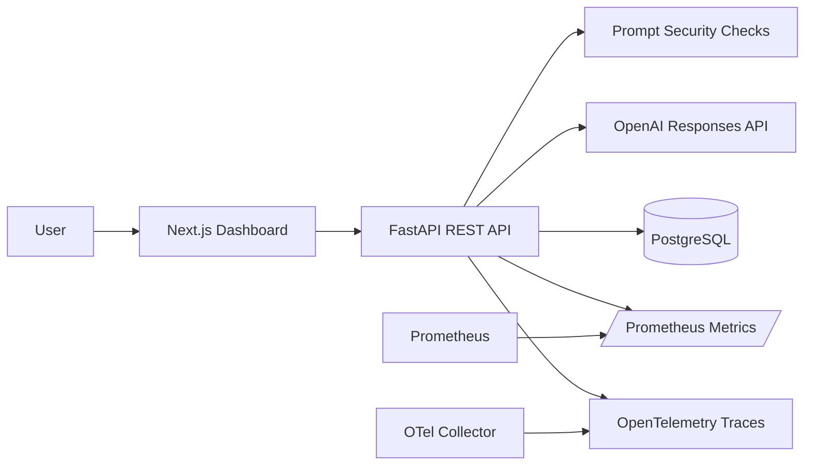

# Architecture

The MVP is split into independently deployable backend and frontend services.

## Backend

- `api/routes`: HTTP endpoints.
- `services`: OpenAI integration, chat orchestration, cost estimation, prompt security.
- `repositories`: SQLAlchemy persistence operations.
- `models`: database tables.
- `schemas`: Pydantic request and response contracts.
- `observability`: Prometheus, tracing, structured logging middleware.

## Frontend

- App Router dashboard in `frontend/app`.
- Typed API client in `frontend/lib/api.ts`.
- Focused UI components in `frontend/components`.

## Observability Signals

- HTTP counters and latency histograms at `/metrics`.
- LLM counters by model, status, and suspicious flag.
- Token and estimated cost counters.
- OpenTelemetry spans around FastAPI, SQLAlchemy, HTTPX, and LLM request orchestration.
